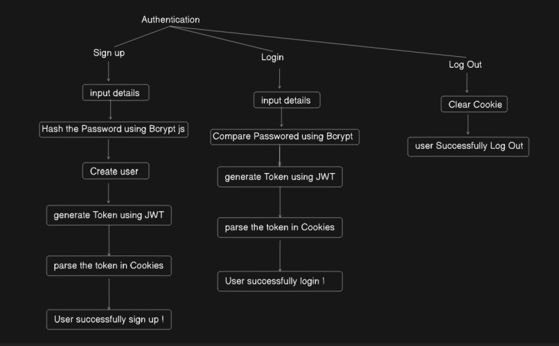
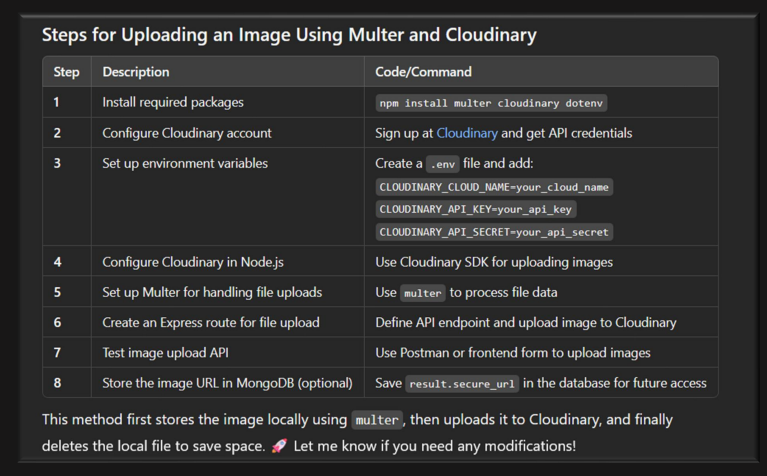
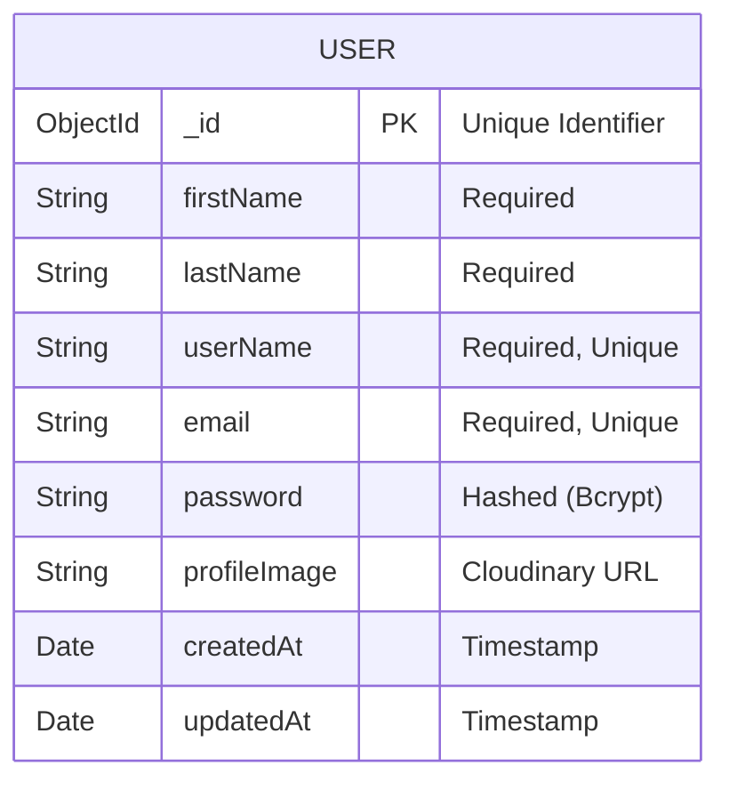

Authentication –
- Verifies who a user is. ( Login & SignUp using email/password )

Authorization –

- Determines what a user can access .


<br>

Authentication & Authorization



<br>

Authentication & image Upload




# MERN Authentication System with Image Upload

An advanced authentication system built with the MERN stack (MongoDB, Express, React, Node.js), featuring secure JWT-based authentication, Cloudinary image uploads, and protected routes.

---

## 🏗️ Architecture & Concepts

### **Authentication vs Authorization**
*   **Authentication**: Verifies *who* a user is (e.g., Login/Signup).
*   **Authorization**: Determines *what* a user can access (e.g., Protected Routes).

### **Tech Stack**
*   **Frontend**: React (Vite), TailwindCSS, Context API, Axios.
*   **Backend**: Node.js, Express.js, Cookie-Parser, JsonWebToken (JWT).
*   **Database**: MongoDB (Mongoose).
*   **Storage**: Cloudinary (for profile image hosting).

---

## 📊 ER Diagram (Database Schema)

This project currently utilizes a single robust entity for managing users.



---

## 📝 How It Works (System Workflow)

### 1. User Registration (SignUp)
1.  **Input**: User enters details (Name, Email, Password) and uploads a profile image.
2.  **Middleware**: `Multer` handles the `multipart/form-data` request.
3.  **Upload**: The image is uploaded securely to **Cloudinary**.
4.  **Database**: Cloudinary returns a secure URL. This URL, along with the hashed password (using `bcrypt`), is saved to **MongoDB**.
5.  **Token**: A **JWT** (JSON Web Token) is generated containing the user's ID.
6.  **Response**: The token is sent back as an **HTTP-Only Cookie** (secure against XSS attacks) and the user data is returned to the frontend.

### 2. User Login
1.  **Input**: User submits Email and Password.
2.  **Verification**: The backend finds the user by email and compares the hashed password.
3.  **Session**: If valid, a new JWT is generated and set as an **HTTP-Only Cookie**.

### 3. State Persistence (Context API)
1.  **Initialization**: When the app loads (`UserContext`), it sends a request to `/api/getuserdata`.
2.  **Verification**: The `checkAuth` middleware verifies the cookie token.
3.  **Access**: If the token is valid, the backend returns the user's profile data.
4.  **UI Update**: The React Context updates the `userData`, allowing access to protected pages like `Home`.

---

## 🚀 Setup Instructions

### 1. Backend Setup
Navigate to the `backend` folder:
```bash
cd backend
npm install
```

Create a `.env` file in `backend/` with the following:
```env
PORT=8000
MONGO_URI=your_mongodb_connection_string
JWT_SECRET=your_jwt_secret_key
CLOUDINARY_CLOUD_NAME=your_cloud_name
CLOUDINARY_API_KEY=your_api_key
CLOUDINARY_API_SECRET=your_api_secret
NODE_ENVIRONMENT=development
```

Run the server:
```bash
npm run dev
```

### 2. Frontend Setup
Navigate to the `frontend` folder:
```bash
cd frontend
npm install
```

Run the client:
```bash
npm run dev
```
